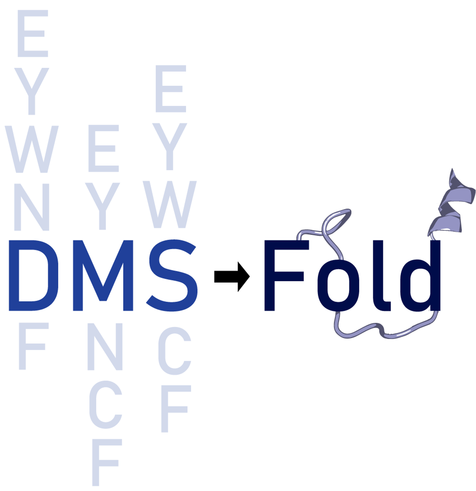

# DMS-Fold

[](https://huggingface.co/LindertLab/DMS-Fold/tree/main)       [](https://huggingface.co/datasets/LindertLab/dmsfold_training_set)      [](https://huggingface.co/datasets/LindertLab/megascale_casp14_cameo_sets)

DMS-Fold is a network which extracts burial information from deep mutational scanning data to enhance structure prediciton. It expands OpenFold with additional DMS-derived embeddings to the network's pair representation, informing about potential burial restraints.

The network currently only supports mutation ΔΔGs, not necessarily any metric of mutational fitness.

## Installation

DMS-Fold is a modified version of OpenFold. See [OpenFold's Github](https://github.com/aqlaboratory/openfold) for instructions on installing openfold dependencies and conda requirements.

DMS-Fold weights can be downloaded from https://huggingface.co/drake463/DMS-Fold/tree/main. The path to the weights can be specified via '--checkpoint_path', which by default is not set.

## Formatting DMS CSV

Single mutant deep mutational scanning thermodynamic stabilities (ΔΔGs) should be given as a tab-seperated CSV. The first column should correspond to the residue sequence number, the second being the wildtype residue one-letter-code, the third is the mutated residue, and the fourth being the measured ΔΔG for the corresponding mutation.

Sequence Number&nbsp;&nbsp;&nbsp;&nbsp;WT-Residue&nbsp;&nbsp;&nbsp;&nbsp;Mutated-Residue&nbsp;&nbsp;&nbsp;&nbsp;ΔΔG

```bash
1  M  A  -0.227
1  M  C  -0.109
1  M  D  -0.518
1  M  E  -0.053
1  M  F  0.734
```  

## Usage
DMS-Fold requires a protein sequence FASTA file, CSV with dms data, and the databases used by OpenFold for MSA/template information.
 
```bash
python3 predict_with_dmsfold.py \
    fasta.fasta \
    dms_data.csv \
    --checkpoint_path openfold/resources/dmsfold_weights.pt \
    --uniref90_database_path uniref90.fasta \
    --mgnify_database_path mgy_clusters_2018_12.fa \
    --pdb70_database_path pdb70/pdb70 \
    --uniclust30_database_path uniclust30/uniclust30_2018_08/uniclust30_2018_08 \
    --bfd_database_path bfd/bfd_metaclust_clu_complete_id30_c90_final_seq.sorted_opt \
    --jackhmmer_binary_path lib/conda/envs/openfold_venv/bin/jackhmmer \
    --hhblits_binary_path lib/conda/envs/openfold_venv/bin/hhblits \
    --hhsearch_binary_path lib/conda/envs/openfold_venv/bin/hhsearch \
    --kalign_binary_path lib/conda/envs/openfold_venv/bin/kalign
```
The use of MSA-subsampling can be specified with `--neff` and size-dependent neff can be specified with `--neff_size_dependent`

## Example
An example command with a provided fasta file, dms csv, and precomputed alignments for 1PWT are located within the directory named 'example'. Expected outputs of relaxed and unrelaxed DMS-Fold predictions and feature pickle file are also provided. To enable deterministic predictions, a singular seed should be specified with '--seed.'

## Network Weights
The weights can be found on the [DMS-Fold model repository](https://huggingface.co/LindertLab/DMS-Fold/tree/main) on huggingface.co. Once downloaded, the weights should be added to DMS-Fold/openfold/resources/. The path to the weights can be specified with `--checkpoint_path'.

## Citing this work
DMS-Fold paper: "TBD"
